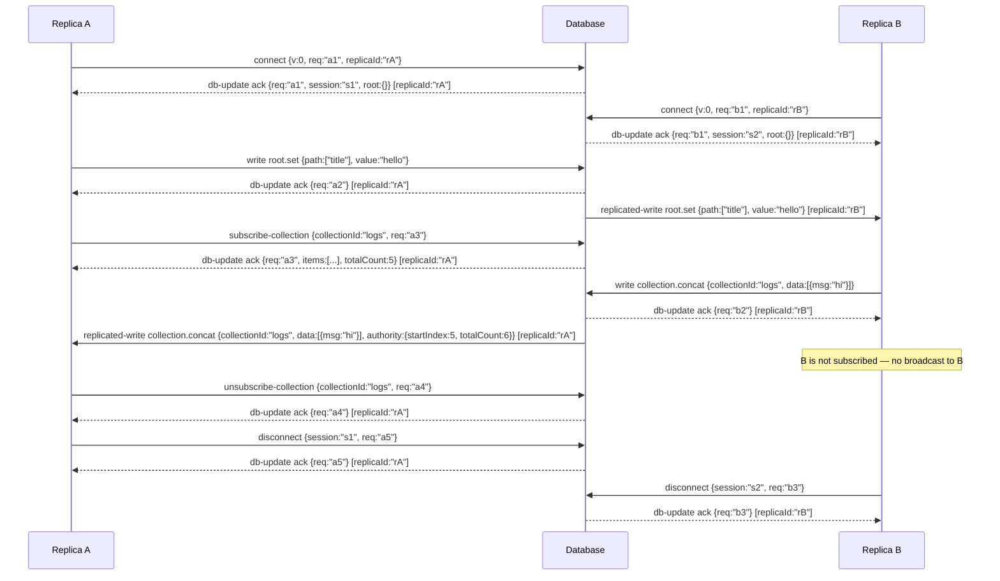

# Kyju Protocol

A protocol for replicating state between a database and its replicas. Replicas maintain an in-memory replica and apply writes optimistically. All writes are eventually consistent.

## Data Model

- **Root** — A JSON object serving as the top-level shared state.
- **Collection** — A referenced, ordered, append-only dataset. Stored as paged files on the server; exposed to replicas as a windowed item range.
- **Blob** — A referenced opaque value.

Collections and blobs are referenced from the root. Accessing a deleted collection or blob is an error (analogous to a null pointer dereference). A collection or blob must not be deleted while references to it exist.

All values in the protocol are JSON-serializable:

```
type Json = string | number | boolean | null | Json[] | { [key: string]: Json }
```

## Transport

The protocol is transport-agnostic. Both replicas and databases are configured with a `send` function to deliver events to the counterpart. Neither party dictates how events are transported. The transport must deliver events in order.

### Replica Identity

Each replica generates a `replicaId` (a unique string) before connecting. The `replicaId` is sent in the connect message and stored by the database on the session. All server-to-replica events are stamped with the target's `replicaId` so the transport layer can route them without understanding the protocol.

`replicaId` is distinct from `sessionId`. A `sessionId` is assigned by the database and scoped to a single connection lifecycle. A `replicaId` is chosen by the replica, persists across reconnects, and exists solely for transport routing.

## Events

Communication is structured as events. Each event has a `kind` that determines its semantics and direction.

| Kind | Direction | Acked? | Description |
|---|---|---|---|
| `connect` | replica -> server | Yes | Initiates a session. |
| `disconnect` | replica -> server | Yes | Tears down a session. |
| `subscribe-collection` | replica -> server | Yes | Subscribes to a collection's data (all items). |
| `unsubscribe-collection` | replica -> server | Yes | Unsubscribes from a collection's data. |
| `write` | replica -> server | Yes | Mutates state. Applied locally then sent to server. |
| `write-batch` | replica-local | Yes (per op) | Multiple write ops applied as a single local transition, then replicated op-by-op to the server. Never crosses the wire as a single event. |
| `replicated-write` | server -> replica | No | Server-broadcast mutation. Applied locally by receiving replicas. |
| `read` | replica -> server | Yes | Queries data from the server. |
| `db-update` | server -> replica | No | Server-initiated state update (acks, metadata changes). |

The server only receives `connect`, `disconnect`, `subscribe-collection`, `unsubscribe-collection`, `write`, and `read` events.

`write` and `replicated-write` carry the same operation types and share the same local-apply logic. The difference: `write` is sent to the server and acked; `replicated-write` is only applied locally.

`write-batch` carries a list of write ops produced by a single client-side transaction (e.g. one `client.update(fn)` call). The replica folds every op into the local state in a single state transition, so subscribers observe exactly one new state for the whole batch rather than one per op. After the local apply, the replica replicates each op to the server as an individual `write` event in batch order; the wire protocol is unchanged.


### Collection Broadcast Rules

Collection write operations (`collection.create`, `collection.concat`, `collection.delete`) are only broadcast to sessions that have an active subscription for the target `collectionId`. A replica must subscribe to a collection before it will receive any collection-related broadcasts.

When broadcasting `collection.concat`, the server attaches `authority.startIndex` and `authority.totalCount` so replicas can reconcile their local state.

## Messages

### Acknowledgment

```
type Ack<T = {}, E extends string = never> = { type: "ack", requestId: string, sessionId: string, error?: Error<E> } & T
```

Sent by the server as a `db-update` event in response to `connect`, `disconnect`, `subscribe-collection`, `unsubscribe-collection`, `write`, and `read` events. On failure, includes `error`. `T` extends the ack with event-specific data.

### Error

Errors are a discriminated union tagged by `_tag`:

```
type InvalidSessionError = { _tag: "InvalidSessionError", message: string }
type VersionMismatchError = { _tag: "VersionMismatchError", message: string }
type NotFoundError = { _tag: "NotFoundError", message: string }
type ReferenceExistsError = { _tag: "ReferenceExistsError", message: string }

type KyjuError = InvalidSessionError | VersionMismatchError | NotFoundError | ReferenceExistsError
```

| Error | Description |
|---|---|
| `InvalidSessionError` | `sessionId` is missing or invalid. Applies to any event after connect. |
| `VersionMismatchError` | Database does not support the requested protocol version. |
| `NotFoundError` | The referenced collection, blob, or page does not exist. |
| `ReferenceExistsError` | Cannot delete a collection or blob that still has references. |

### Authority

When the database broadcasts a write via `replicated-write`, it may attach an `authority` field containing metadata required for eventual consistency. Replicas must use `authority` to reconcile their local state. The shape of `authority` is operation-specific.

## Sessions

Each replica supports exactly one session.

### Connect

Event kind: `connect`

```
{ type: "connect", version: number, requestId: string, replicaId: string }
```

Ack: `Ack<{ root: object }, "VersionMismatchError">`

The database must reject the connection if it does not support the requested `version`. All subsequent events must include `sessionId`. Events without a valid `sessionId` are rejected.

### Disconnect

Event kind: `disconnect`

```
{ type: "disconnect", sessionId: string, requestId: string }
```

Ack: `Ack`

Both parties must clean up all resources associated with the session.

## Subscriptions

A replica must subscribe to a collection before receiving any collection-related broadcasts. Each session maintains a set of subscribed `collectionId`s. The server holds a collection lock while processing a subscribe to prevent race conditions with concurrent writes.

### Subscribe Collection

Event kind: `subscribe-collection`

```
{ type: "subscribe-collection", collectionId: string, sessionId: string, requestId: string }
```

Ack: `Ack<{ items: Json[], totalCount: number }, "NotFoundError">`

The server returns all items in the collection plus the current `totalCount`. The replica loads the full dataset into memory.

The server must acquire the collection lock before adding the subscription and reading items. This guarantees that a concurrent `collection.concat` either completes before the subscribe (so the returned items include the new data) or waits until after (so the concat broadcast reaches the newly subscribed session).

### Unsubscribe Collection

Event kind: `unsubscribe-collection`

```
{ type: "unsubscribe-collection", collectionId: string, sessionId: string, requestId: string }
```

Ack: `Ack`

Removes the collection from the session's subscription set. The replica should clean up the collection from local state when there are no remaining local subscribers.

## Write Operations

Carried by `write` (replica -> server), `write-batch` (replica-local), and `replicated-write` (server -> replica) events. The database applies them and broadcasts as `replicated-write`. Root and blob writes are broadcast to all other connected replicas. Collection writes are broadcast only to sessions subscribed to the target collection.

### Batched Writes

`write-batch` is a replica-local event used by clients to commit several write ops as a single local transition:

```
{ type: "write-batch", ops: WriteOp[] }
```

Each element of `ops` is one of the operation shapes defined below (`root.set`, `collection.*`, `blob.*`). The replica must:

1. Fold every op into local state in a single state transition. Subscribers observe one new state, not one per op.
2. Notify collection-concat callbacks once per `collection.concat` op in the batch, in batch order, after the local apply.
3. Replicate each op to the server as an individual `write` event in batch order. Failure semantics are identical to issuing those `write` events one by one — ops earlier in the batch may already be applied locally when a later op's ack returns an error.

The batch never crosses the wire as a single event. Implementations that don't need batching can treat `write-batch` as syntactic sugar over a sequence of `write` events, at the cost of subscribers observing intermediate states.

### Root

Root writes are last-writer-wins.

**Set field**

```
{ type: "root.set", path: string[], value: Json }
```

Ack: `Ack`

### Collection

**Create**

```
{ type: "collection.create", collectionId: string, data?: Json[] }
```

Ack: `Ack`

**Concat**

```
{ type: "collection.concat", collectionId: string, data: Json[], authority?: { startIndex: number, totalCount: number } }
```

Appends one or more items to the collection. When broadcast as a `replicated-write`, the server attaches:
- `authority.startIndex` — the global index of the first appended item.
- `authority.totalCount` — the total item count after the append.

Receiving replicas use `totalCount` to update their local count. If the appended items fall within the replica's current window, they are merged into the replica's item array. If not, only `totalCount` is bumped (the replica's items stay unchanged; the UI can show "N new items" or similar).

Ack: `Ack<{}, "NotFoundError">`

**Delete**

```
{ type: "collection.delete", collectionId: string }
```

Ack: `Ack<{}, "NotFoundError" | "ReferenceExistsError">`

### Blob

Blob writes are last-writer-wins.

**Create**

```
{ type: "blob.create", blobId: string, data: Uint8Array, hot?: boolean }
```

Ack: `Ack`

**Set**

```
{ type: "blob.set", blobId: string, data: Uint8Array }
```

Ack: `Ack<{}, "NotFoundError">`

**Delete**

```
{ type: "blob.delete", blobId: string }
```

Ack: `Ack<{}, "NotFoundError" | "ReferenceExistsError">`

## Read Operations

Carried by `read` events (replica -> server). The database responds only to the requesting replica via ack.

### Collection

**Fetch range**

```
{ type: "collection.fetch-range", collectionId: string, range: { start: number, end: number } }
```

Ack: `Ack<{ items: Json[], totalCount: number }, "NotFoundError">`

One-shot read by global item index. Returns items in `[start, end)` plus the current `totalCount`. Does not require or affect a subscription. Does not move the window for subscribed replicas.

### Blob

**Read**

```
{ type: "blob.read", blobId: string }
```

Ack: `Ack<{ data: Uint8Array }, "NotFoundError">`

## Database Updates

Carried by `db-update` events (server -> replica). These are server-initiated and not acked by the replica.

**Blob metadata update**

```
{ type: "blob.metadataUpdate", blobId: string, fileSize: number }
```

**Reconnect**

```
{ type: "reconnect" }
```

Instructs all connected replicas to tear down their current session and establish a new one. Upon receiving `reconnect`, a replica must:

1. Send `disconnect` and await the ack.
2. Send `connect` with the protocol version to establish a new session.
3. Replace all local state with the fresh root and empty collections/blobs from the connect ack.

The server broadcasts `reconnect` when an external process has modified database state in a way that requires replicas to re-sync.

## Replica State

Each replica maintains the following state for subscribed collections:

```
type CollectionState = {
  id: string
  totalCount: number
  items: Json[]
}
```

- `id` — the collection ID.
- `totalCount` — total number of items in the collection.
- `items` — all items in the collection.

The replica holds the full dataset in memory. Pages are a storage concern internal to the database and are not exposed to replicas.

## Plugins

`root._plugins` is a reserved namespace for extension data. Each plugin uses a globally unique key under `_plugins` (e.g. `root._plugins.myPlugin`). Plugins are responsible for avoiding key collisions. Plugin data is written via normal `root.set` operations — the database does not special-case `_plugins`.

## Reference Types

Collection and blob references are stored in the root as plain objects:

```
type CollectionRef = { collectionId: string, debugName: string }
type BlobRef = { blobId: string, debugName: string }
```

`debugName` is a static label for debugging purposes.

## Example

Two replicas connecting, subscribing, writing, and disconnecting.


